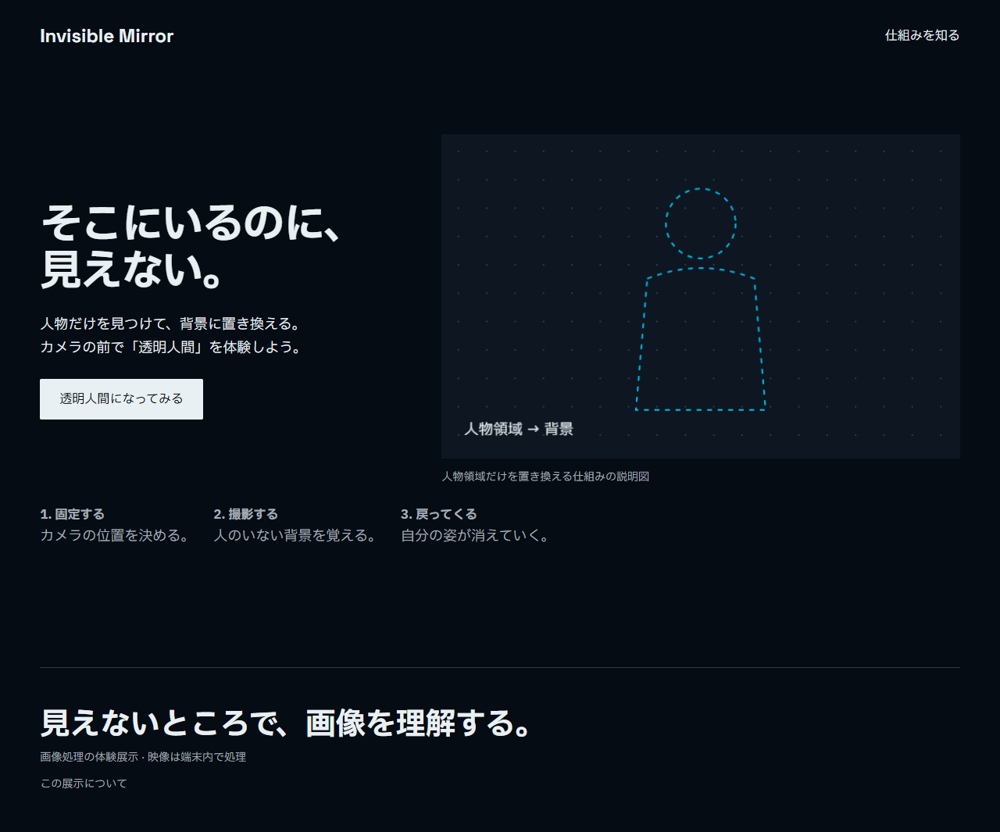

# Invisible Mirror

カメラに映った人物を背景に置き換える、透明人間の展示です。MediaPipeで人物領域を取り出し、先に撮影した背景と合成します。

カメラを固定し、誰も映っていない状態で背景を撮影してください。撮影ボタンを押してから3秒間は画面の外に出ます。戻ってきたら、透明・半透明・輪郭・デジタル模様の4モードを切り替えて遊べます。



## 手元で動かす

Node.js 22を使います。

```sh
npm ci
npm run dev
```

http://localhost:3002 を開いてください。モデルや画像はリポジトリに含めています。再取得するときだけ `npm run assets` を実行します。

カメラや照明、背景の家具を動かしたら背景を撮り直してください。撮影した背景はページを開いている間だけ保持します。映像をサーバーに送信したり、ファイルに保存したりする処理はありません。

## Vercelに置く

Vercelの **Add New → Project** から [`kanalia7355/mirror`](https://github.com/kanalia7355/mirror) を選びます。Root Directoryはリポジトリ直下。Next.js、Node.js 22、インストール・ビルドコマンドは設定ファイルに指定済みです。環境変数や外部DBの設定はありません。

推論はブラウザーで動き、モデルとWASMはアプリと同じ配信元から読み込みます。初回表示にはモデルのダウンロード時間がかかります。

```sh
npm run lint
npm run typecheck
npm run build
```

動作確認の範囲は [VALIDATION.md](VALIDATION.md)、ライブラリと素材の出典は [THIRD_PARTY.md](THIRD_PARTY.md) にまとめています。
